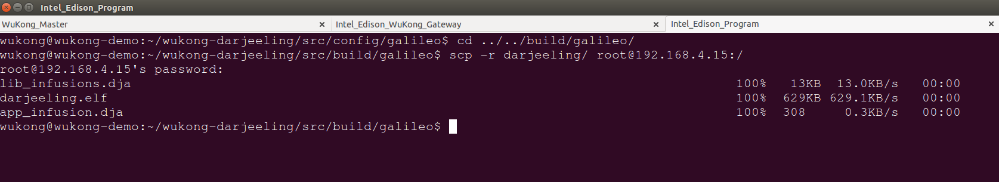
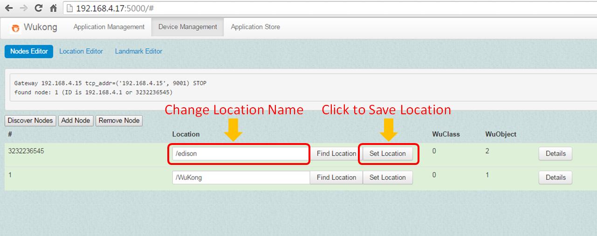
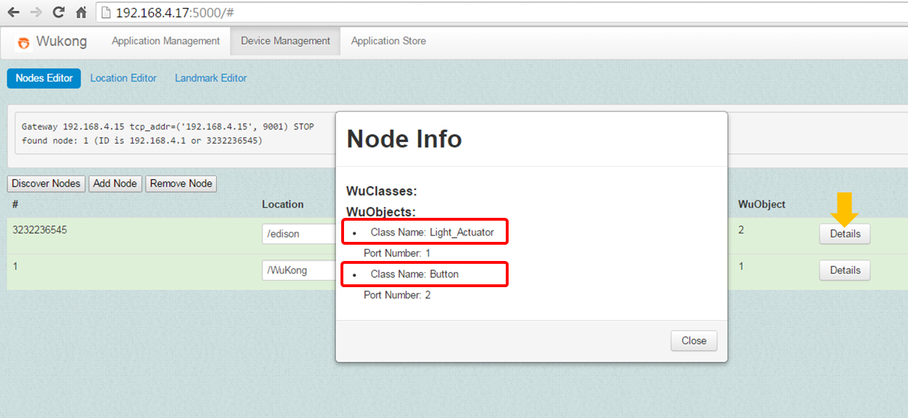

# ** LED Control Using C Program - 君哲(testing) **  

####**Building WuKong System**  
* Open three terminals. The first one is for WuKong Master; the second one is for WuKong gateway; the third one is for Intel Edison Board. 

*  **For WuKong Master**    
    *  Download the source code from github as below:  

        ```bash
        git clone http://github.com/wukong-m2m/wukong-darjeeling    
        ```
        
          

    *  Build infuser
        ```bash
        cd <path_of_source_code>/wukong-darjeeling/src/infuser/
        gradle
        ```
        
        
    *  Copy a configuration file for WuKong Master  
        ```bash
        cd <path_of_source_code>/wukong-darjeeling/wukong/config/
        cp master.cfg.dist master.cfg
        ```

    *  Check IP address of your PC  
     
        

    *  Run Wukong Master    
        ```bash
        cd <path_of_source_code>/wukong-darjeeling/wukong/master/
        python master_server.py
        ```
        

*  **For WuKong Gateway**  
    *  Use SSH command to access to Intel Edison board  
    
        ```bash
        ssh root@<IP address of Intel Edison board>
        ```
    
    *  Download the source code from github as below:  
    
       ```bash
       git clone http://github.com/wukong-m2m/wukong-darjeeling
       ```
       

    *  Copy a configuration file for WuKong Gateway  
        ```bash
        cd <path_of_source_code>/wukong-darjeeling/wukong/gateway/  
        cp gtwconfig.py.dist gtwconfig.py
        ```
        
 *  Check IP address and network interface of Intel Edison board as below.   
 
      

 *  Configure gtwconfig.py according to the above information
 
     ```bash
     vim gtwconfig.py # if you cannot use vim, please install it with "opkg install vim"

     # Change MASTER_IP to IP address of your PC
     # Change TRANSPORT_INTERFACE_ADDR to network interface of Intel Edison board
     ```
      

  *   Run Wukong Gateway    
      ```bash
      cd <path_of_source_code>/wukong-darjeeling/wukong/gateway/
      python start_gateway.py
      ```
      


*  **For Intel Edison board**  

   *  Copy configuration file for SmartThings device.  
      The building process will not pass unless we copy this configuration file.  
      
      ```bash
      cd <path_of_source_code>/wukong-darjeeling/src/lib/wkpf/c/posix/native_wuclasses
      cp stconfig.h.dist stconfig.h
      ```
      
   *  Enable button and light actuator capability for WuKong device  
      There are many WuClasses supported in WuKong. Before compiling and building WuKong source code, we need to select which wuclass will be enabled in the built image file. Once the WuKong device runs this image, it will have capacity of that WuClass. Please follow the below command to enable selected WuClasses.
      ```bash
      cd <path_of_source_code>/wukong-darjeeling/src/config/galileo  
      vim enabled_wuclasses.xml  
      ```
      
         
      
   *  Compile and build WuKong source code    
      ```bash
      cd <path_of_source_code>/wukong-darjeeling/src/config/galileo   
      gradle -b ../../build.gradle  
      ```
      
   *  Send the built ELF file to the root directory of Intel Edison board  
      ```bash
      cd <path_of_source_code>/wukong-darjeeling/src/build/galileo  
      scp -r darjeeling/ <Device name of Intel Edison>@<IP address of Intel Edison board>:/
      ```
      
        

####**Device Management**    

*  For Intel Edion board    

    *  Use Chrome browser to open FBP editor: http://localhost:5000
        (Currently, only Chrome browser supports FBP editor)   
        

    *  Enter Device Management page and check initial state  
        
        

    *  Click Add Nodes button to be ready to include Intel Edison board to WuKong Master  
    
        
        
        

    *  Use SSH command to access to the Intel Edison board   
    
        ```bash
        ssh <Device name of Intel Edison>@<IP address of Intel Edison board>
        ```

    *  Go to the folder of darjeeling at root directory    
    
        ```bash
        cd /darjeeling
        ```
     
    * Execute darjeeling ELF file to enter learning mode  
    
        ```bash
        darjeeling.elf -n <network interface> -a
        ```
        
        <*network interface*>   
        Intel Edison board: **wlan0**  
        Intel Galileo board: **wlp1s0**
          
    *  Once WuKong Master has found Intel Edison board, press "Stop to complete operation"           
     
        

    *  Restart darjeeling ELF file and back to running mode  
       ```bash
       (ctrl + C)
       darjeeling.elf -n <network interface>  
       ```

    *  Check device management list again   

        

    *  Modify the device location and press Set Location button to restore

        

    *  (Optional) Press Details button to check sensor profile of this Python program

        

####**Application Deployment**  

*  After adding Intel Edison board to WuKong Master, we are ready to draw a LED control application using FBP editor and deploy this application to Intel Edison board. Please follow the instructions of [APPLICATION MANAGEMENT](../Ch5/Ch5_Application_Management.md).   

*  After deploying application, prepare a short metal wire. Plug one end point of wire to DIGITAL pin5 of Intel Edison board, while toggle the other end point between power 5V and GND. This action used to emulate pressing a real button. Then you can see the LED on intel Edison board blink as shown below.    
  
  
     

    
    