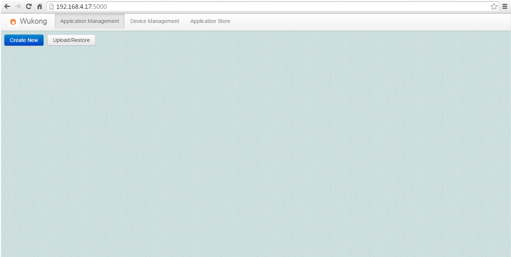
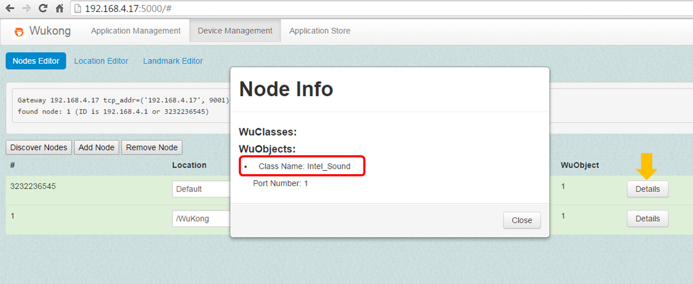
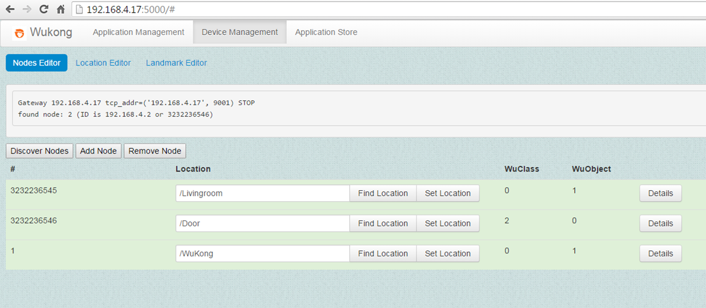

##4.1.2 Include a New Device

Before we can deploy any IoT application on WuKong, Master must find the devices available to run it. In this section, we show how to use the device management capability in WuKong Master.

1.  Use the Chrome browser to open the Master interface: http://localhost:5000  
   <!--- (Currently, only the Chrome browser supports FBP editor)   --->
 
 

2.  Click on the **Device Management** tab and the **Discover Node** button to check the initial state.  
     

3.  Click the **Add Node** button to include a new device in Master.   
    
 

    Note: If the message shown is not <font color="red">ready to ADD</font>, press the <font color="red">Stop to complete operation</font> button and try the step again.  
    
  

4.  Open a terminal and go to the folder where the device program is stored.  

    ```bash
    cd <path_of_source_code>/wukong-darjeeling/wukong/gateway/udpwkpf/   
    ```
        
5.  Run the device program udpdevice_intel_sound.py. This Python program will start the device to receive a node ID from the WuKong gateway, and then the Intel_Sound WuClass on the device.  
      
    ```bash
    python udpdevice_intel_sound.py <IP address of gateway> \
    <IP address of device program>:<arbitrary port number>
    ```
    
    <font color="red">Note: When the device program is started, this device will get a Node ID assigned by the Master.</font>
      
    
6.  Click on the <font color="red">Stop to complete operation</font> button.

   

7.  Click the <font color="red">Discover Nodes</font> button to refresh the device list. 
  
    

8.  The sensor profile of this device can be seen by clicking the <font color="red">Details</font> button.    
  
      

9.  The location of the device can be changed as follows.  
 
   
   
10.  Add another device program called udpdevice_logic.py by repeating Step 3 to Step 9. After that, the device management list should be as follows.   

  
