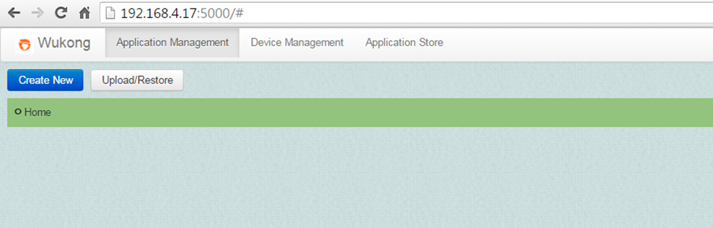
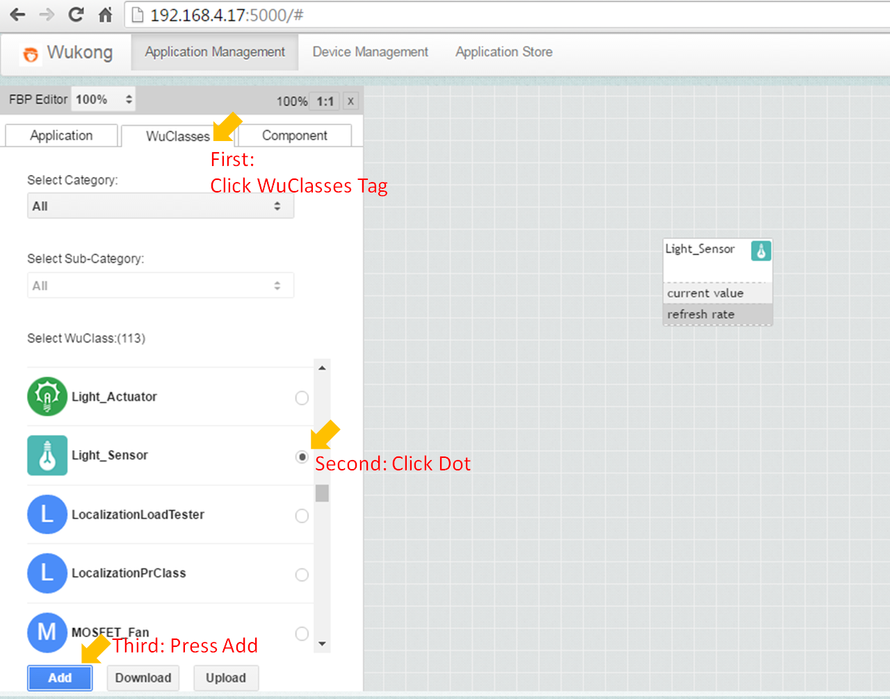
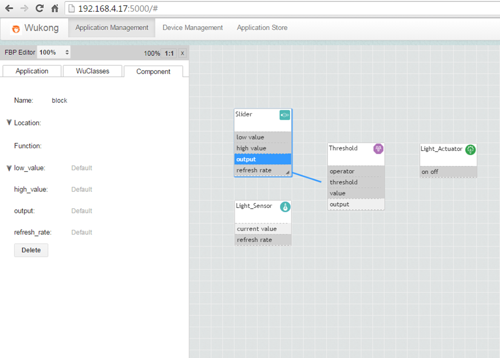
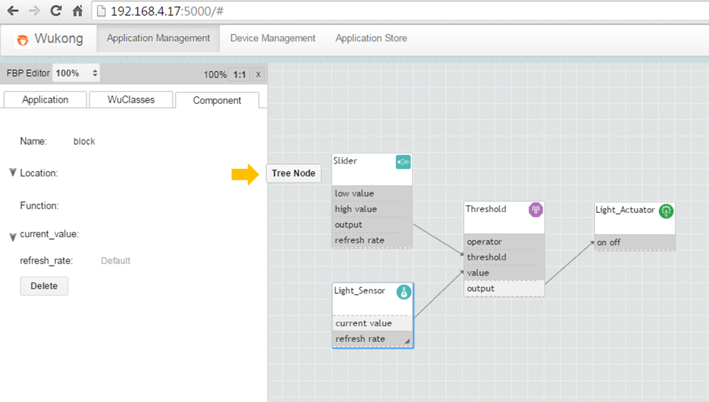
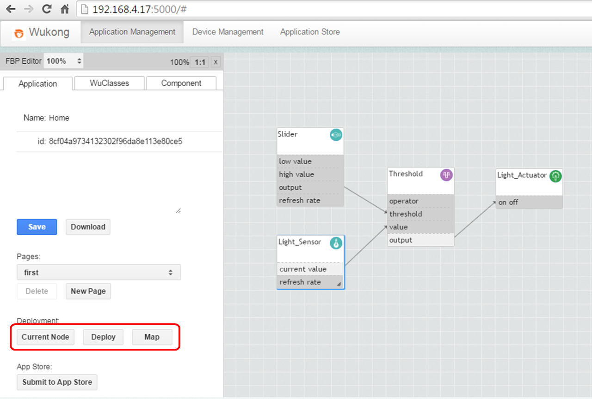
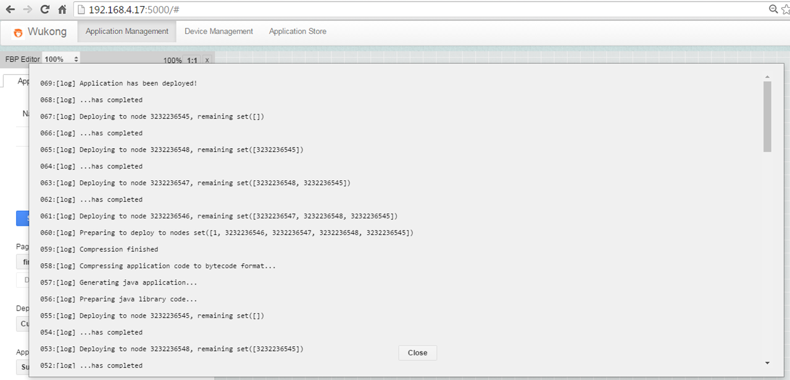

##5.3 Application Management
###Createing an FBP  

<!--
*This section  is revised from [PREVIOUS WUKONG UI MANUAL](https://docs.google.com/document/d/1d06id4TxZu5Cp6MvyJ4-2rgaHDvMKR29IIUpdW72_IY/edit#).*
-->
Click the **Application Management** top menu. It will show a list of existing applications. We can add a new application using the **Create New** button, or we can delete an application by clicking the   symbol on the right-hand side. After creating a new application, we can click on its name to edit the application.  

*  How to Add Components   

  To add components to an FBP, first click on the WuClasses tab at the left-hand side menu to list all available components in the WuKongStandardLibrary.xml. Next, scroll down the list to find the right component and press the **Add** button to generate a new instance of the component on the canvas. The figure below shows the canvas after adding a Light_Sensor component. 
  
  

  

 The Light_Sensor component has two properties. Input properties are displayed with gray color; in this case, a “refresh rate” property specifies how often the sensor needs to take a new measurement (in milliseconds). Output properties are displayed with white color; in this case, the current sensor value represents the measured light sensor data.  
 
 In the following example we will create a simple application to turn on a light if the light sensor’s value drops below a certain value. For this application we need 4 components:  
  1. A Light Sensor component: This will return a value in the range of 0 to 255.
  2. A Threshold component: This will compare the light sensor’s value to the desired minimum light value
  3. A Slider component: This will provide the Threshold component with it’s threshold value. 
  4. A Light Actuator: This represents a lamp. 
    
      
    
    
*  How to Create Links   

  After placing all required components on the canvas, the properties can be connected using the link.   
  1. First, a component has to be selected by clicking on it.   
  2. Next, click a source property, and a link will be generated from that property. 
  3. When a link is generated, draw the cursor to the target property and click on it.
  4. Last, a pop-up screen will be displayed to confirm which properties of the source and target component are going to be linked.  
  
  The picture below shows the canvas after adding all the required components, and the process of creating the link between the Slider’s output value property and the Threshold’s threshold property. 

     
   

*  How to Set the Location  

   When deploying the application, the Master will try to find suitable nodes in the network to run each component on. This is the mapping step discussed below. Since there might be multiple sensors in different locations, we need to specify the location where we want to measure the light value and turn on the lamp.

   To set a component’s location, move the cursor around the **Location** blank until a **Tree Node** button is shown up as below. 
   
       
   
   Click on the **Tree Node** button and a pop-up screen will be prompt to let you select location for each component.  

     

###Deploying an Application

After an application has been defined, a user may want to deploy it in his network. This is done in the **Application** tab at the left-hand side menu. 

Deploying an application consists of three steps that will be done by the master automatically in the future, but are currently separated to allow for more control over the process and to show the intermediate results.
These three steps are shown as three buttons in the **Application** tab.

  

*  First Step - Current Node   

  The first button “Current Node” will show the discovery result. When we press this for the first time, the Master will probe the known nodes in the network for their capabilities, which may take some time. After this the cached result is used.  
   
  Each node is represented in a row in the table, when the row is filled in red it means this node has not responded to Wukong Master’s query and is considered dead at the moment of discovery; on the other hand, it means this node has responded and is considered alive.   
  
  If one suspects that the discovery result does not reflect the current device setup, then one could go back to the **Device Management** page to redo the discovery.  

  
  
  
*  How to Map  

  When the master knows the resources available in the network, the next step is to map each component in the flow based programme onto the nodes in the network.  
  
  Pressing the **“Map”** button will cause the master to attempt to create a mapping. The result is shown as a table with multiple columns:  
  1. WuClass Name contains the name of the wuobject in the FBP application  
  2. Node Id contains the destination node id that the corresponding component will be deployed to
  3. Port Number is the port number the component will take on the destination node.

  

*  How to Deploy  
  
  After a mapping has been made, the application can be deployed by pressing the **"Deploy"** button. This may take up to half a minute. When the process is finished, a log will be printed showing all the internal steps the master takes to compile the application and upload it to the nodes.  

  

