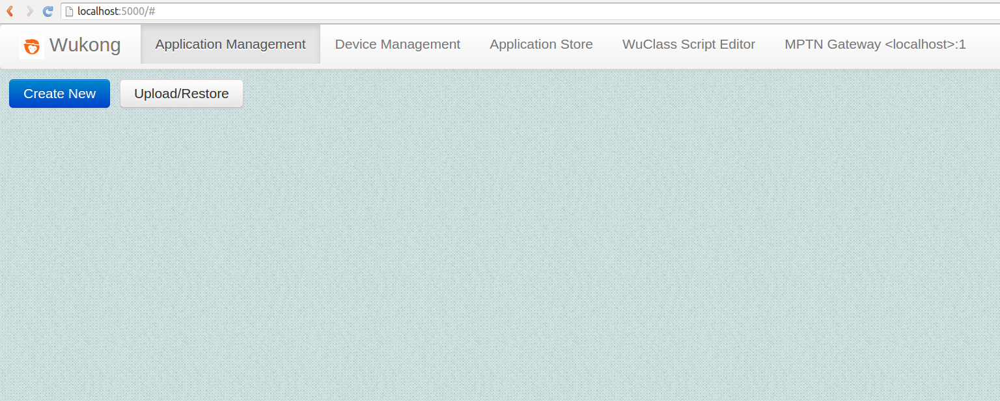

#Chapter 5: Using the WuKong Management Interface  
<!--
* **Requirements**  

  Follow the instructions of [Ch4](../Ch4/OP1/Ch4_part_1_start_master_and_gateway_program.md) to start master and gateway program so that we can enter the WuKong master's web interface, i.e. the FBP editor.  
  
  Download and install Chrome browser. Currently, only Chrome browser supports WuKong web interface.  
  
  Use Chrome browser to open FBP editor: http://localhost:5000

* **WuKong Web Interface**  

 There are three main parts in WuKong management interface: the front end, the back end, and the gateway. The front end is the GUI of wukong, where an user can trigger all functionality of device and application management. The back end is a python tornado server that implements mechanisms of all functionality. The gateway is a software module to bridge the connections of different networks.   
 -->
  We now show how to use the WuKong management in the following sections.

  1.  [Network Management](Ch5_Network_Management.md): To present the network architecture of WuKong, and explain how to configure master and gateway. 

  2.  [Device Management](Ch5_Device_Management.md): To add devices to a WuKong system, configure their locations, and discover their availability.  

  3.  [Application Management](Ch5_Application_Management.md): To create a flow based program, map the components to sensor profiles, and deploy the application on each device.  

  4.  [Application Store](Ch5_Application_Store.md): To create the collection of  your FBP applications and make them available for sharing.    

 
 
