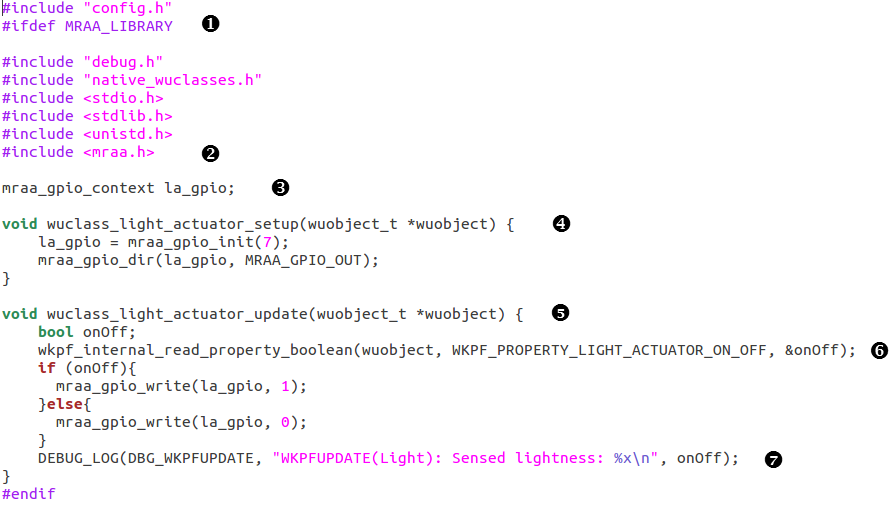
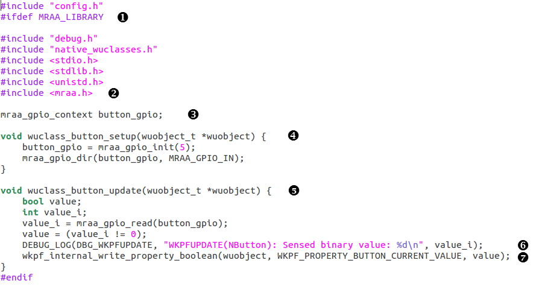

# Using C programming language

Although each platform of the last table has individual WuClass category, their WuClass implementions are quite similar. Each WuClass is composed of two main functions: one is setup() function, the other is update() function. The setup() function is called only once after a WuKong image is executed. The purpose of the setup function is to initialize variables. On the contrary, the update() function is called repeatedly whenever the property of the WuClass changes, or the refresh time is reached.  

* ###**Light actuator sample code**   
    This sample code is specific to Intel Edison and Intel Galileo platforms.  
    
 

  This MACRO is defined in the <*path_of_source_code*>/wukong-dareeling/src/config/galileo/include/config.h. As for the Raspberry Pi, we have to change the MACRO to be GROVE_PI.      
    
    mraa library is imported to control GPIO of Intel Edison board or Intel Galileo board.   
     
    Define a global mraa structure variable, whose name is unique among all WuClasses.     
    
    In the setup function, we use mraa functions to specify GPIO pin and direction option. Please be noted that the name of the setup function should follow this pattern. In other words, the function name should be wuclass_<*name of wuclass*>_update.        
  
    WuObject is an instance of WuClass. The WuObject is a data structure defined in the WuKong. It stores the value of each property. The update function can read the property value, do some processing and then write the result back to each property. 
    
    This function reads the on_off property of the light actuator from the WuObject. The second argument is an enum generated by Wukong according to WuKongStandardLibrary.xml during compilation. Please follow this format to indicate which property you want to read or write. The format is WKPF_PROPERTY_<*WUCLASS NAME*>_<*PROPERTY_NAME*> (all upper case letters). The third argument is a pointer of variable to retrieve value.  

    DBG_WKPFUPDATE is MACRO defined in the <*path_of_source_code*>/wukong-dareeling/src/config/galileo/include/config.h. To see the debug message, please uncomment this MACRO in the config.h. 
    
    
    
* ###**Button sample code**   
    This sample code is specific to Intel Edison and Intel Galileo platforms.  
    
    
  The code structure is similar to the light actuator WuClass. But since button is a sensor, we have to use another property propagation API() to send value to a next FBP component. 
  
* ###**Property Propagation API**   
    The APIs below are used in the WuClass to read and send data throught WuObject. Currently, there are three data types in the WuKong: 16-bit integer, boolean, and refresh_rate (i.e. a typedef of integer). Thus, there are three pairs of API corresponding to each data type.   
  ```bash
  * Integer   
  
    wkpf_internal_read_property_int16(wuobject, property_number, value)  
 
    wkpf_internal_write_property_int16(wuobject, property_number, value)   
 
  * Boolean  
   
    wkpf_internal_read_property_boolean(wuobject, property_number, value)  
 
    wkpf_internal_write_property_boolean(wuobject, property_number, value)  
 
  * Refresh rate   
 
    wkpf_internal_read_property_refresh_rate(wuobject, property_number, value)   
 
    wkpf_internal_write_property_refresh_rate(wuobject, property_number, value)   
  ```
 
 
* ###**Summary**  
To summarize this section, here are several steps to write a C Wuclass:
  * Choose your platform and find a WuClass sample files according the table in the last page.  
  * Create your own WuClass in the same folder.      
  * When writing a WuClass, do configuration in the setup function, and design how to process property value of WuObject in the update function.    
  * Choose a property propagation API if you need to read or send value of WuObject.    
 
 


