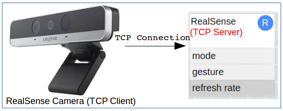
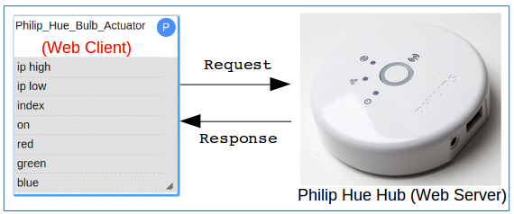
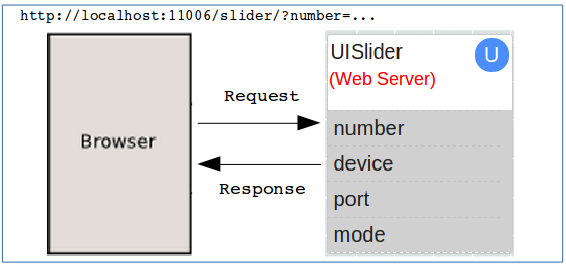

##Chapter 7: Building Connections to Non-WuKong Services 

In this chapter, we show some advanced examples on how to create an external data flow in WuClass using protocols such as TCP and Web sockets. With these types of non-WuKong data flow, we can connect WuKong FBP components to external Web-based services and commercial IoT products. Such connections allow users to implement flexible and powerful distributed IoT applications by integrating WuKong and Web. 

We show three examples that uses TCP server and Web connections respectively. The WuClass examples in this chapter are more complex than the ones in the previous chapter. 
Some of these WuClass examples use device-specific APIs to invoke their services. Other examples show how to use various web-access protocols in IoT applications.
To keep examples simple and easy to understand, some non-essential details may be omitted. The presentation is focused on how to create data flows with different types of products. 

* [TCP Server WuClass  ](Ch7_For_RealSense_Camera.md)  
  In this example, we use Twisted library to establish a TCP connection between Intel RealSense Camera and FBP components so that whenever the camera captures a new gesture, it will send the reading to WuKong. This design can apply to other external sensing devices as well. 
  
     

*  [Web Client WuClass ](Ch7_For_Philip_Hue_Series.md)  
   In this example, we use the Twisted Web library to send HTTP requests to a Philip Hue hub. When the Hue's hub server receives messages, it will control Hue lights accordingly and return a response. 
   
  
*  [Web Server WuClass](Ch7_For_Web_Application.md)     
   In this example, we use the Twisted Web library to implement a Web server to receive URL requests from a browser application. The browser application provides a UI for users to control the output value of a UISlider component. In this way, we can provide HTTP APIs for developers to control WuKong applications. As long as they implement a Web client on their platform, they can use the HTTP API to make a connection to WuKong FBPs.  
   
  
  

