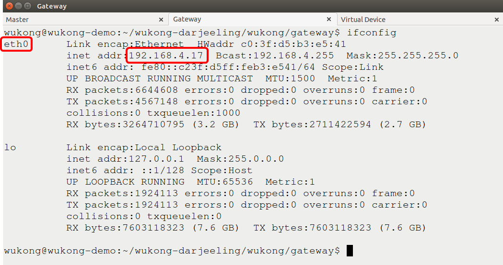

##4.1.1 Start the Master and Gateway

1. On your computer, download the source code from github as below:  
   ```bash
   git clone -b release0.4 http://github.com/wukong-m2m/wukong-darjeeling
   ``` 
   
2. Build infuser  

   ```bash
   cd <path_of_source_code>/wukong-darjeeling/src/infuser/  
   gradle 
   ``` 
        
        
3. Copy the configuration file for Master  
   
   ```bash
   cd <path_of_source_code>/wukong-darjeeling/wukong/config/  
   cp master.cfg.dist master.cfg  
   ```
     
4. Run the Master
    
   ```bash
   cd <path_of_source_code>/wukong-darjeeling/wukong/master/   
   python master_server.py   
   ```
   

5.  On the computer, open a new terminal to copy the configuration file for gateway program  
   
   ```bash
    cd <path_of_source_code>/wukong-darjeeling/wukong/gateway/  
    cp gtwconfig.py.dist gtwconfig.py
    ```

6.  Configure gtwconfig.py   
   
   ```bash
    # Use ifconfig command to check the network information.   
    ifconfig
    ```  
      
    ```bash
    vim gtwconfig.py 
    # Change MASTER_IP to the IP address of the Master.     
    # Change TRANSPORT_INTERFACE_ADDR according to yout network interface above.  
    ```
      

8.  Run the gateway program    
     ```bash
     cd <path_of_source_code>/wukong-darjeeling/wukong/gateway/
     python start_gateway.py
     ```  
      

