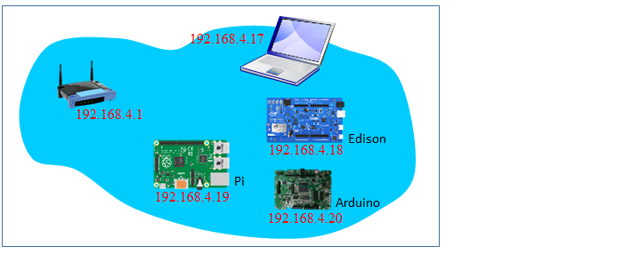
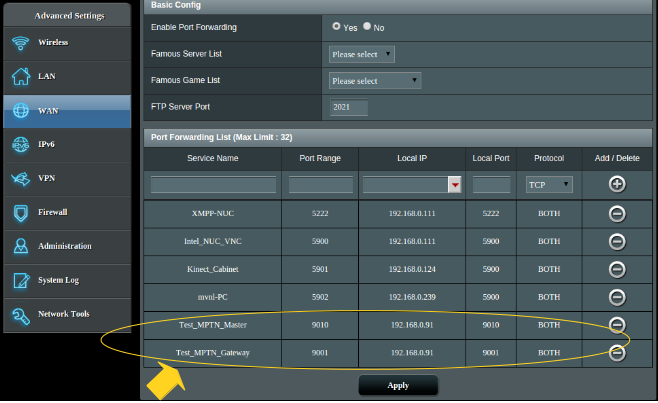

##5.1 Network Management  
Before a WuKong application can be deployed, we must set up the network connections among Master, gateways and devices so that they can communicate with each other correctly. As we have discussed in [Section 1.1](../01-HowToUse/How_to_Use_This_Book.md), a WuKong system has three types of system components: Master, gateway, and node (physical or virtual device). Each component may be run on a specific hardware platform in a **local area network** or on **different subnets**. In this section, we first present system components running in the same local area network. Later, we will include system components running on different subnets. 

* **
#### All Components in the Same Local Area Network  

This network setting is shown in the following figure. In this setting, there are laptop, IoT boards with embedded Linux, and IoT board without OS support (Arduino). The laptop is used to run all the system components as discussed in Section 4.1.  The IoT board with embedded Linux  can be used to run both gateway and devices as shown in  Section 4.2. The IoT board without OS support can only be used to run FBP components.    


The following steps are used to start master and gateway on the same local area network. They are the same as in Section 4.2.1.         

1. Make sure the laptop is connected to the router in the local area network. If the network environment has been changed, please follow the instructions in the section 4.1.5 to restore default settings.

2. Make sure the infuser has been compiled. If not, please do the following:   
   ```bash
   cd <path_of_source_code>/wukong-darjeeling/src/infuser/  
   gradle 
   ``` 
3. Make sure the config file for Master has been created. If not, please do the following:      
   ```bash
   cd <path_of_source_code>/wukong-darjeeling/wukong/config/  
   cp master.cfg.dist master.cfg  
   ```
4. Start Master.   
   ```bash
   cd <path_of_source_code>/wukong-darjeeling/wukong/master/   
   python master_server.py   
   ```     
   
5. After starting Master, open a terminal to start the gateway. You can either run the gateway on an IoT board or on the laptop.   Notethat the order of starting Master and gateway must be followed on the first run.   

6.  Make sure the config file for gateway has been created. If not, please do the following: 
   ```bash
   cd <path_of_source_code>/wukong-darjeeling/wukong/gateway/  
   cp gtwconfig.py.dist gtwconfig.py
 
   # Note: For running the gateway program on a IoT board 
   # the source code has to be downloaded first with next line 
   # git clone http://github.com/wukong-m2m/wukong-darjeeling
   ```  
 
7. Check the network interface of the platform running the gateway.     

8. Configure gtwconfig.py according to the gateway network information.
 
     ```bash
     vim gtwconfig.py  

     # Change MASTER_IP to the IP address of the master program.   
     # Change TRANSPORT_INTERFACE_ADDR to network interface of the gateway program  
     ```
9. Start the gateway.   
   ```bash
   cd <path_of_source_code>/wukong-darjeeling/wukong/gateway/
   python start_gateway.py
   ```   
   
10. Use a Chrome browser and connect to http://<*MASTER_IP*>:5000. 
   
* **
#### On Different Subnets

An example network setting is shown in the following figure. In this figure, there are three subnets. Subnet A has a Raspberry Pi with a local IP of 192.168.16.3 and Subnet B has an Intel Edison with a local IP 192.168.4.18. To build a system in this environment, we need to run a WUKong gateway on each subnet. In addition, since we don't handle NAT punch-through between different subnets, we must run Master on a third subnet. In this example, Master is run on Subnet C.  


The following steps are used to start Master and gateways.    

1. Add port forwarding at 9010 and 9001 of **each** subnet router. Port 9010 is used by Master to receive packet from a gateway. Port 9001 is used by the gateway to support RPC requests from Master. The following screenshot shows the interface of ASUS RT-AC68 WiFi router. Please refer to your router manual to set port forwarding.  
  
  

2. Configure **each**  router to use a different network prefix. The reason is that if two subnets use the same network prefix, their messages may have conflicts when received by Master. Therefore, in our example, the network prefix of each subnet is different. Please refer to your router manual to change the network prefix.    
 
  

3. For the computer on Subnet C, follow steps 1 to 4 of the instructions for devices on the same Local Area Network to start Master.

4. After starting Master, open a terminal to remotely access to Raspberry Pi on Subnet A.  

5. Make sure the source code has been downloaded on the laptop or Raspberry Pi on Subnet A. If not, please use the following command to download the source code:  
   ```bash
   git clone http://github.com/wukong-m2m/wukong-darjeeling 
   ```
6. Make sure the config file for gateway has been created. If not, please do the following commands: 
   ```bash
   cd <path_of_source_code>/wukong-darjeeling/wukong/gateway/  
   cp gtwconfig.py.dist gtwconfig.py
   ```
7. Find the public IP or WAN IP of each router. In the figure, the public IP of each router are 233.1.1.2 (subnet A), 233.1.1.3 (subnet B) and 233.1.1.4 (subbet C).  

8. Configure gtwconfig.py.       
 
     ```bash
     vim gtwconfig.py  

     # Change MASTER_IP to the public IP of WiFi router on the subnet C.  
     # In this example, the MASTER_IP is 233.1.1.4
     # Change TRANSPORT_INTERFACE_ADDR to network interface of the laptop or Pi   
     ```
9. Run gateway on the laptop or Raspberry Pi on Subnet A   
   ```bash
   cd <path_of_source_code>/wukong-darjeeling/wukong/gateway/
   python start_gateway.py  
   ```

10. Repeat Steps 4 to 9 on the laptop or Edison on Subnet B.  

11. Open a Chrome browser on **subnet C** and enter http://<*MASTER_IP*>:5000.  Note: This webpage cannot be seen on the subnet A or B unless you have set port forwarding for 5000 on subnet A or B.  


